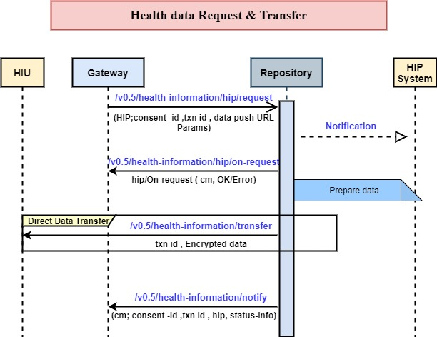

The data request and transfer process between the HIU, CM and HIP passes through the following three stages:

**First Stage**

- The HIU system for patient’s health information to the HIP, through the CM against a valid granted consent.
- The CM assigns a transaction ID for the entire data flow and communicates this Id to the health repositories of the HIU and the HIP.
- The HIU’s health repository embeds three key elements within the health information request:
    -  The consent ID corresponding to the consent artefact against which the information request is being made.
    -  A data push URL, which is a callback URL that indicators where the information can be pushed by the HIP’s health repository. This URL can be different from the HIU’s access URL, provided at the time of registration with the gateway. The HIU can specify a different URL for the data flow, in order to keep its identity secret to the extent possible.
  - Several parameters such as the date-time range for the requested and a set of encryption parameters for the HIP repository to encrypt the information. The Elliptic-curve Diffie–Hellman based encryption standard is used for encrypting health information.
  
The HIU’s health repository relays all this information to the CM through the gateway. From the CM, the information is relayed to the HIP’s health repository (via the gateway).

**Second Stage**

Once the HIP repository receives the information, it first validates the information request, as follows:

- The HIP finds out if the consent ID corresponds to an expired, paused or revoked artefact.
- It then checks if the request’s date-time range will correspond to the range for which the consent artefact allows information access. It also ensures that the encryption parameters are correctly defined.
- Once the above checks are made and validated, the HIP health repository encrypts the requested health records and forwards it along with the transaction ID to the HIU’s data push URL, after signing the encrypted data with its long-term private key.

**Third Stage**

Finally, the CM receives notifications from both the HIP and the HIU. The HIP’s health repository notifies the CM that the requested information was transmitted to the HIU. The HIU’s health repository sends a notification that the requested information was successfully received, or that the request failed.

All above 3 stages that pertains to HIP are shown in the following diagram:

