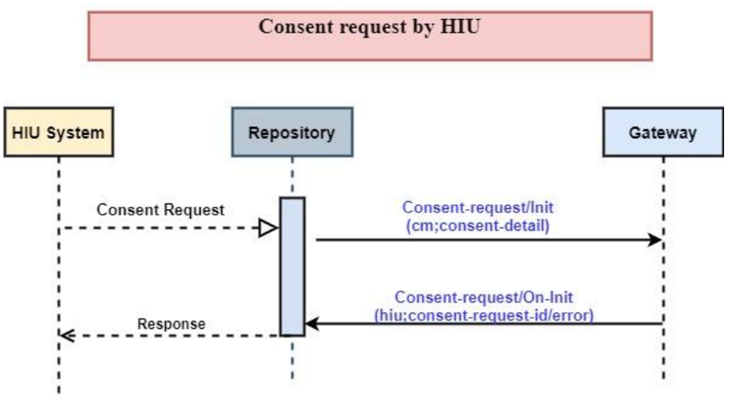

### Creation of Consent Request

### Overview of the functionality
 - From an HIU perspective, the flow begins when the HIU (e.g., a Doctor at a Hospital) requests consent to view the patient’s data.
 - Upon receipt of such a request from Gateway, CM acknowledges and sends back a consent request ID to the HIU via the gateway.
 - The CM then notifies the patient that an HIU has made a consent request.
 - The patient can view the request details and choose to either grant consent or deny it.
 - Subsequently, the CM notifies the HIU requester of the patient’s consent or denial status via the gateway.


1. If the request is granted, the CM sends across the Ids of the consent artefacts that were created against the request, to the HIU.
2. If the request is denied, the CM simply notifies the HIU of the denial of the request.


### API Sequence

The following diagram explains the consent request creation flow of forwarding the request to the gateway so that gateway can forward it to respective CM




### API Information Request Response


**1. Generate the Gateway session**

Bearer token is received as part of respose and should be passed a Authorization token for subsequent API calls.

**URL:** https://dev.ndhm.gov.in/gateway/v0.5/sessions

**Request:** POST  

**Body:**

```json
{
    "clientId": "your-clientID",
    "clientSecret": "your-clientSecret",
    "grantType": "client_credentials"
}
```

**Response:** 200   OK

```json
{
    "accessToken": "eyJhbGciOiJSUzI1NiIsInR5cCIgOiAiSldUIiwia2lkIiA6ICJBbFJiNVdDbThUbTlFSl9JZk85ejA2ajlvQ3Y1MXBLS0ZrbkdiX1RCdkswIn0.eyJleHAiOjE2NTMzNjkyNTYsImlhdCI6MTY1MzM2ODY1NnR",
    "expiresIn": 600,
    "refreshExpiresIn": 1800,
    "refreshToken": "eyJhbGciOiJIUzI1NiIsInR5cCIgOiAiSldUIiwia2lkIiA6ICIyMWU5NzA4OS00ZTcxLTQyNGEtOTAzYS1jOTAyMWM1NmFlNWYifQ.eyJleHAiOjE2NTMzNzA0NTYsImlhdCI6MTY1MzM2ODY1NiwianRpIjoi",
    "tokenType": "bearer"
}
```


\
\
\
